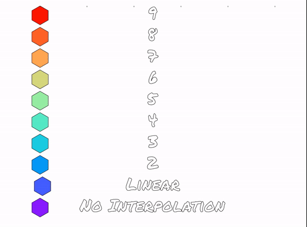

# Easing Animations with Python
This is a set of functions that allow you to bring After effects style easing to your python animation by interpolatating a set of parametric arrays.

Ingredients necessary to make the animations:
* an intitial time vector
* a dependent data matrix - each row will be a different variable, the columns correspond to the initial time vector
* an output time vecotr upon which to be interpolated

# Power Interpolation

