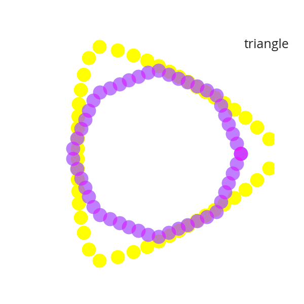
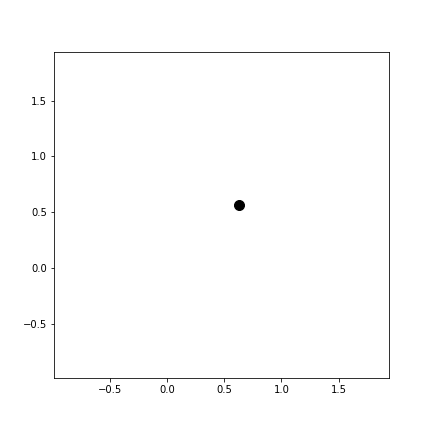
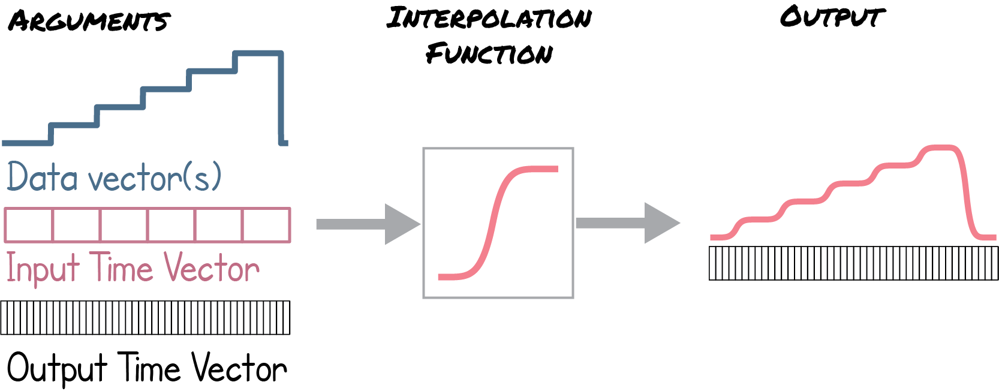
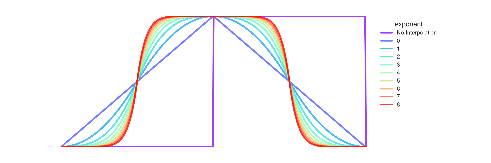

# Easing Animations with Python
 
 
This package is meant to make animations easy in python. There are a number of methods built around an "easing" class.  

# Quick-start guide
Full walk-through available [in this notebook](animation_playground.ipynb)

begin by installing via pip 

```python
pip install easing

from easing import easing
 ```
 
In order to render any of these animation, you'll need to have the following installed

* FFMPEG for .mp4 renders (brew install ffmpeg on mac)
* Imagekick for .gif renders(brew install imagemagick)


This code takes either numpy arrays or pandas dataframes and turns them into animations. You can make scatter plots..
```python
data=np.random.random((10,2))
easing.Eased(data).scatter_animation2d(n=3,speed=0.5,destination='media/singlepoint.gif')
```
 
 
 ```python
size=100
u=np.random.multivariate_normal([1,1],[[1, 0.5], [0.5, 1]],size=size).reshape(1,-1)
v=np.random.multivariate_normal([1,1],[[2, 1], [1, 2]],size=size).reshape(1,-1)
w=np.random.multivariate_normal([1,1],[[4, 2], [2, 4]],size=size).reshape(1,-1)

data=pd.DataFrame(np.vstack([u,v,w]),index=['small','medium','large'])
easing.Eased(data).scatter_animation2d(speed=0.5,label=True,plot_kws={'alpha':0.5},destination='media/multipoint.gif')
```
 
 
Animated barcharts...
  ```python
  data=pd.DataFrame(abs(np.random.random((3, 5))),
                  index=['Jurassic', 'Cretaceous', 'Precambrian'],
                  columns=['Tyrannosaurus','Pterodactyl','Stegosaurus','Raptor','Megaloadon'])

easing.Eased(data).barchart_animation(plot_kws={'ylim':[0,1],'xlim':[-2,5]},smoothness=40,speed=0.5,label=True,destination='media/animatedbar.gif')
```


Or time series plots...
  ```python
data = np.random.normal(scale=0.5,size=400)
easing.Eased(data).timeseries_animation(starting_pos = 25,
                                        speed=25,
                                        plot_kws={'ylim':[-3,3],'bins':np.linspace(-3,3,50)},destination='media/normdist.gif')
```


# Further Explanations
 
Ingredients necessary to make the animations:
* an intitial time vector
* a dependent data matrix - each row will be a different variable, the columns correspond to the initial time vector
* an output time vecotr upon which to be interpolated

# Interpolation class
Before generating the easing, you must create the object of class easing
```python
    ease = Eased(data, input_time_vector, output_time_vector)
```
All subsequent functions will be called on this object.

 

# Power Interpolation

The primary form of interpolative easing (or *tweening*) is based on powers (e.g. linear, quadratic, cubic etc.)
 The power easing function takes one variable - the exponent integer (n). Increasing the interger
 increases the *sharpness* of the transition.

 ```python
    out_data = ease.power_ease(n)
```
 

 

# No interpolation
If you simply want to extend the data to have the same number of points as an interpolated set
without actually interpolating, simply call the No_interp() function
```python
    out_data = ease.No_interp()
```

<!-- 

# To do list
* meta ask how do we track these projects?
options include:
-jira
-trello
-[meat space notepads]

* hit major objectives for MVP
-cleanup and remererge 
-save files to scratch, not in the repo
-2d scatterplot
-evolving histogram
-some sort of callable example interface?
-


* nice haves
-chaginger trendline?
-flashy example (chroma shift)
-map overlay?
-bending curve  (not scatter plot) -->
